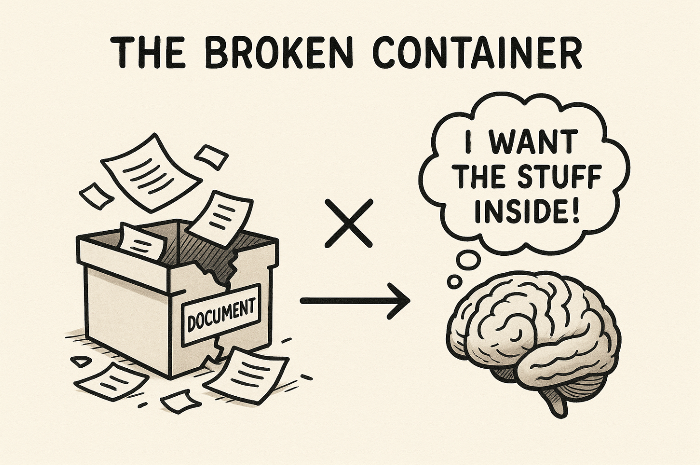

# VS Code as the Universal Abstraction Layer: Why Your Code Editor is Actually Your Operating System

## The Revelation Moment


I had an epiphany while working late one evening. As I switched between Google Drive in my browser and VS Code on my desktop for the hundredth time that week, it hit me: **VS Code isn't just a code editor—it's become my abstraction layer to the internet.**

Think about it. Every day, we juggle between local files, cloud storage, browser-based editors, and desktop applications. We save to Drive, sync to Dropbox, edit in Notion, and somehow try to keep everything connected. But what if I told you that your code editor could be the single interface that unifies all of this chaos?

This isn't just about convenience—it's about fundamentally rethinking how we interact with our digital workspace. For modern developers and content creators, this realization changes everything about productivity, workflow, and the relationship between local and cloud computing.

## Part 1: The Problem with Traditional Cloud Sync

### The Google Drive Disconnect



Let's be honest about the Google Drive experience. You create a document in Google Docs, it lives in your browser, and while Google promises seamless sync to your desktop, the reality is far messier.


Here's the typical setup: You have your Google Drive folder on your computer, looking something like this:

```
📁 Google Drive
  └── 📁 My Drive
      ├── 📄 Important Document.docx
      ├── 📄 Project Notes.gdoc
      └── 📄 Meeting Minutes.docx
```

And then you have your VS Code workspace somewhere completely separate:

```
📁 Development
  └── 📁 my-project
      ├── 📄 index.html
      ├── 📄 README.md
      └── 📁 assets
```

**The disconnect is real.** They don't sync together in any meaningful way. You end up with:

- Files trapped in browser interfaces
- Clunky offline experiences
- No real-time connectivity between your editor and cloud services
- Constant context switching between applications
- Version conflicts when multiple sync systems collide

The "cloud-native" promise often means "browser-trapped reality."


### Why Traditional Sync Falls Short

Traditional cloud sync treats your computer as just another endpoint, not as the primary creation environment. This creates friction:

1. **Latency in sync**: Changes don't appear instantly
2. **Format limitations**: Cloud editors don't support all file types
3. **Offline inadequacy**: Limited functionality without internet
4. **Tool fragmentation**: Different interfaces for different file types

## Part 2: VS Code as an Abstraction Layer

### More Than Just a Code Editor

Here's where the magic happens. When you open a directory in VS Code, you're not just editing code—you're creating a **unified interface** for everything in that project space.


Inside VS Code, everything converges:

- **Claude AI** for intelligent assistance
- **Terminal access** for system operations
- **File management** with advanced search and organization
- **Extensions** that connect to virtually any service
- **Version control** with Git integration
- **Live preview** for immediate feedback

### The Power of Local-First, Cloud-Ready

When you work in VS Code, everything exists locally first. This means:

```markdown
# Your VS Code Project Structure
📁 my-content-project/
├── 📄 article-draft.md          # ← You're editing this locally
├── 📄 notes.md                  # ← Voice notes and brainstorming
├── 📁 assets/
│   ├── 🖼️ diagrams/
│   └── 🖼️ screenshots/
├── 📄 publish.sh                # ← One-click deployment
└── 📄 config.json              # ← Cloud service connections
```

**This changes everything.** Your content creation studio is now:

- **Offline-capable**: Work anywhere, sync when ready
- **Version-controlled**: Every change is tracked
- **Extensible**: Add functionality through extensions
- **Integrated**: Terminal, AI, file management in one place
- **Deployable**: Push to any service with a command

## Part 3: The Frontend vs Backend Philosophy

### Where Editing Really Happens

Here's a crucial insight that most people miss: **You don't edit in the frontend.**

Let me break this down:

- **Frontend** = Where you deploy and activate
- **Backend** (your computer) = Where you create and edit
- **Browser** = Activation layer, not creation layer


Think about it: When you're building a website, you don't edit the live site. You edit locally, then deploy. The same principle applies to content creation, documentation, and any digital work.

### The Browser as an Action Layer

The browser becomes your **deployment interface**, not your editing interface:

```bash
# In your VS Code terminal
npm run build          # Compile your content
npm run preview        # Test locally
npm run deploy         # Push to production
```

This separation means:

1. **Full control** over your editing environment
2. **No internet dependency** for creation
3. **Instant preview** without network latency
4. **Professional tools** instead of simplified web interfaces

## Part 4: The New Content Creation Workflow

### From Local to Global in One Click

Here's what the new workflow looks like:

#### 1. Create in VS Code

```markdown
# article-draft.md
# My Amazing Article

This is where I write, using:
- Markdown for formatting
- Voice notes for brainstorming
- Claude for assistance
- Local assets for media
```

#### 2. Preview Instantly

- Live Server extension shows changes in real-time
- Markdown Preview for formatted view
- Terminal commands for custom preview setups

#### 3. Deploy Everywhere

```bash
# Deploy to multiple platforms with one command
./deploy.sh --target medium,dev-to,personal-blog
```

#### 4. No Context Switching

Everything happens in one interface. No more:

- Opening browser tabs for editing
- Switching between apps
- Losing work due to browser crashes
- Waiting for cloud sync

### Voice Notes Integration

As I'm creating this article, I can literally speak my thoughts directly into VS Code:

```markdown
<!-- Voice note: 2024-01-15 14:30 -->
I'm realizing that VS Code becomes your content creation studio. 
This is where you create. This is where you make all of your stuff. 
You can do voice notes, scripting, builds, and work with LLMs.
```

Then ask Claude to clean it up:

> Claude, please refine this voice note into a proper paragraph about VS Code as a content creation studio.

The result appears instantly in the same document.

## Part 5: Why This Changes Everything

### The Implications

This paradigm shift has massive implications:

#### 1. Every Computer Becomes a Development Machine

Your laptop isn't just a consumption device—it's a creation powerhouse. With VS Code, you have:

- Professional editing capabilities
- Direct access to system resources
- Extension ecosystem for any workflow
- Terminal power for automation

#### 2. Content Creation = Code Development

The tools that made developers productive now serve content creators:

- Version control for document history
- Branching for different versions
- Merge conflicts resolution for collaboration
- Automated testing for content quality

#### 3. Death of "Save to Cloud" as a Separate Step

When your local environment **is** your cloud interface, saving becomes deployment:

```bash
# Instead of "Save to Google Drive"
git add .
git commit -m "Updated article draft"
git push origin main
# Automatically triggers deployment to blog, Medium, etc.
```

#### 4. True Offline-First, Cloud-Ready Workflows

Work on a plane, in a coffee shop with bad wifi, or in your backyard. When you're ready, everything syncs with one command.


## Part 6: Practical Implementation

### Making It Work for You

Here's how to set up VS Code as your content creation hub:

#### Step 1: Install Essential Extensions

```bash
# Content Creation Extensions
- Markdown All in One
- Live Server
- GitLens
- Claude AI (or similar AI assistant)
- Spell Right
- Word Count
- Auto-Open Markdown Preview
```

#### Step 2: Configure Your Workspace

```json
// .vscode/settings.json
{
    "markdown.preview.openMarkdownLinks": "inPreview",
    "files.autoSave": "afterDelay",
    "git.enableSmartCommit": true,
    "workbench.editor.enablePreview": false
}
```

#### Step 3: Set Up Cloud Connections

```javascript
// config.js - Connect to your services
const deployTargets = {
    medium: { apiKey: process.env.MEDIUM_API },
    devTo: { apiKey: process.env.DEVTO_API },
    blog: { webhook: process.env.BLOG_WEBHOOK }
};
```

#### Step 4: Create Deployment Scripts

```bash
#!/bin/bash
# deploy.sh
echo "Deploying content..."
node scripts/publish-to-medium.js
node scripts/update-blog.js
git add . && git commit -m "Published $(date)"
echo "Deployment complete!"
```

#### Step 5: Organize Your Content Structure

```
📁 content-workspace/
├── 📁 articles/
│   ├── 📄 drafts/
│   ├── 📄 published/
│   └── 📄 templates/
├── 📁 assets/
│   ├── 🖼️ images/
│   └── 📁 videos/
├── 📁 scripts/
│   ├── 📄 deploy.sh
│   └── 📄 preview.js
└── 📄 content-config.json
```

### Essential Extensions for Content Creators

| Extension                        | Purpose                   | Why It Matters                         |
| -------------------------------- | ------------------------- | -------------------------------------- |
| **Markdown All in One**    | Enhanced markdown editing | Tables, shortcuts, preview             |
| **Live Server**            | Local preview server      | Instant feedback on changes            |
| **GitLens**                | Advanced Git integration  | Track every change and collaboration   |
| **Thunder Client**         | API testing               | Test your deployment endpoints         |
| **Code Spell Checker**     | Grammar and spelling      | Professional content quality           |
| **Paste Image**            | Easy image insertion      | Drag and drop image workflow           |
| **Auto Rename Tag**        | HTML editing              | When creating web content              |
| **Bracket Pair Colorizer** | Code structure            | Better organization of complex content |

### Connecting to Cloud Services

#### Medium Integration

```javascript
// scripts/publish-to-medium.js
const medium = require('medium-sdk');
const fs = require('fs');

const client = new medium.MediumClient({
    clientId: process.env.MEDIUM_CLIENT_ID,
    clientSecret: process.env.MEDIUM_CLIENT_SECRET
});

// Read your markdown file and publish
const content = fs.readFileSync('article.md', 'utf8');
// Convert and publish to Medium
```

#### Dev.to Integration

```javascript
// scripts/publish-to-devto.js
const axios = require('axios');

const publishToDevTo = async (article) => {
    await axios.post('https://dev.to/api/articles', {
        article: {
            title: article.title,
            body_markdown: article.content,
            published: true
        }
    }, {
        headers: {
            'api-key': process.env.DEVTO_API_KEY
        }
    });
};
```

## Quick Setup Guide

### 5 Steps to Turn VS Code into Your Content Hub

1. **Create a content directory**: `mkdir my-content-hub && cd my-content-hub`
2. **Initialize VS Code workspace**: `code .`
3. **Install key extensions**: Markdown All in One, Live Server, GitLens
4. **Set up Git**: `git init` for version control
5. **Create your first article**: `touch first-article.md` and start writing

### Tool Comparison Chart

| Feature                        | VS Code + Extensions | Notion       | Google Docs  | Traditional IDE |
| ------------------------------ | -------------------- | ------------ | ------------ | --------------- |
| **Offline Capability**   | ✅ Full              | ❌ Limited   | ❌ Limited   | ✅ Full         |
| **Version Control**      | ✅ Git native        | ❌ Basic     | ❌ Basic     | ✅ Git native   |
| **Customization**        | ✅ Unlimited         | ❌ Limited   | ❌ None      | ✅ High         |
| **AI Integration**       | ✅ Multiple options  | ✅ Native    | ❌ None      | ❌ Limited      |
| **Multi-format Support** | ✅ Everything        | ❌ Limited   | ❌ Limited   | ✅ Code focused |
| **Deployment Options**   | ✅ Unlimited         | ❌ Limited   | ❌ None      | ❌ Limited      |
| **Collaboration**        | ✅ Git-based         | ✅ Real-time | ✅ Real-time | ❌ Limited      |
| **Learning Curve**       | 📊 Medium            | 📊 Low       | 📊 Low       | 📊 High         |

## Conclusion: The Future is Local-First, Cloud-Native

### Key Takeaways

VS Code represents more than just another text editor—it's a **paradigm shift** in how we think about computing interfaces. By treating your code editor as an abstraction layer to the internet, you gain:

1. **Complete control** over your creation environment
2. **Professional-grade tools** for any content type
3. **Seamless integration** between local and cloud workflows
4. **Unlimited extensibility** through the vast ecosystem
5. **Future-proof foundation** that adapts to new services and tools

> "VS Code becomes an abstraction layer for anything that connects me to the internet"

This isn't about abandoning cloud services—it's about **reclaiming agency** in how you interact with them. Instead of being trapped in browser interfaces designed for consumption, you're using professional creation tools designed for productivity.

> "The frontend is where you deploy stuff. The frontend is actionable."

The distinction between creation and deployment environments matters more than ever. Your computer is where ideas become reality. The cloud is where reality becomes accessible to others.

> "Editing the content is what you're going to do on your computer."

### The Path Forward

As AI tools become more sophisticated and cloud services more numerous, the need for a unified local interface grows stronger. VS Code provides that interface today, but the principles apply broadly:

- **Local-first creation** with cloud distribution
- **Professional tools** over simplified web interfaces
- **Automation and scripting** for repetitive tasks
- **Version control** for everything, not just code
- **Extensibility** to adapt to future needs

### Call to Action

Start treating your editor as your primary interface. Pick one directory, open it in VS Code, and build your first content project. Install a few extensions, set up Git, and experience the difference between editing in a browser and editing in a professional environment.

The future of content creation isn't in the cloud—it's on your computer, with the cloud as your distribution network.

Your code editor is becoming your operating system. The question isn't whether this will happen, but whether you'll be early to recognize and leverage this shift.

---

*Ready to make VS Code your content creation powerhouse? Start with one project, one directory, and experience the difference between browser-based creation and professional local-first workflows.*