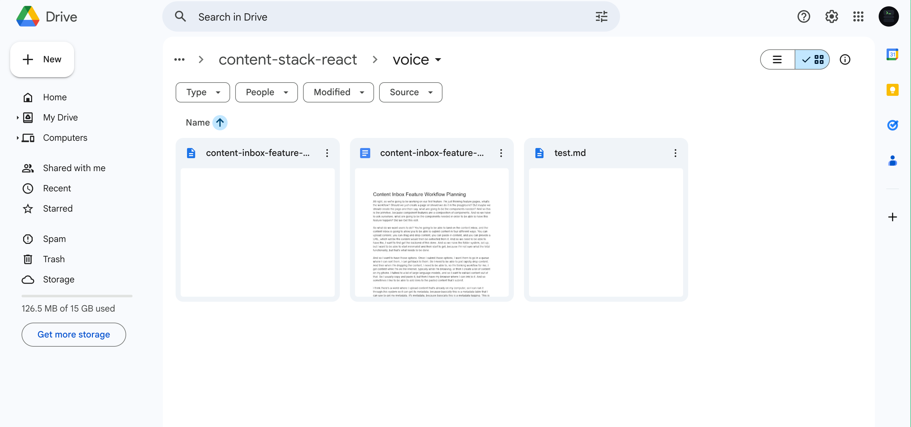
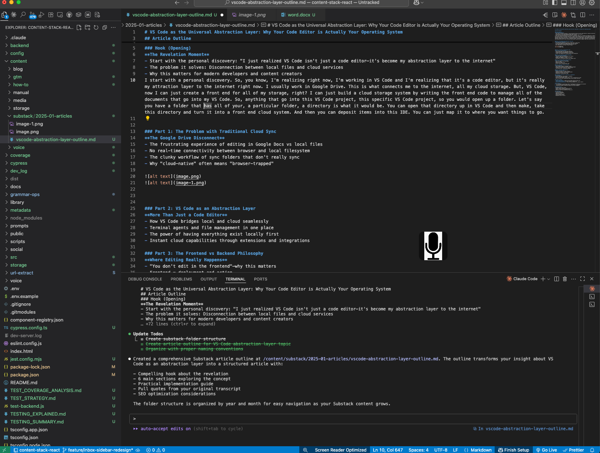
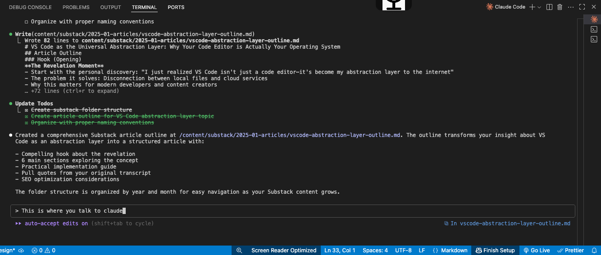

# VS Code as the Universal Abstraction Layer: Why Your Code Editor is Actually Your Operating System

## Article Outline

### Hook (Opening)
**The Revelation Moment**
- Start with the personal discovery: "I just realized VS Code isn't just a code editor—it's become my abstraction layer to the internet"
- The problem it solves: Disconnection between local files and cloud services
- Why this matters for modern developers and content creators
I start with a personal discovery. So, you know, I'm realizing right now, I'm working in VS Code and I'm realizing that it's a code editor, but it's really my attraction layer to the internet right now. I usually work in Google Drive. This is what connects me to the internet, all my cloud storage. But, VS Code, now I can just create a front end for all of my storage, right? I can just build a cloud storage system by writing the front end code to manage all of the documents that go into my VS Code. So, anything that go into this VS Code project, this specific VS Code project, so you would open up a folder. Let's say you have a folder that has all of your, a particular folder, a directory is what it would be. You can open that directory up in VS Code and then make, take this directory and turn it into a front end cloud system. And then you can deposit items into this IDE. You can just map it to where you want things to go.

### Part 1: The Problem with Traditional Cloud Sync
**The Google Drive Disconnect**
- The frustrating experience of editing in Google Docs vs local files
- No real-time connectivity between browser and local filesystem
- The clunky workflow of sync folders that don't really sync
- Why "cloud-native" often means "browser-trapped"

Google's great for, typically would fix this by having your Google Drive downloaded to your hard drive, and then you just operate out of the Google folder. And you would create a Google like this. This would have a My Drive, or you would have a Google Drive, right? This is where your Google Drive would look. It's loading. But anyway, this is where it would be. This would be the Google Drive right here. And it's loading, like this would be the one on my computer, right? So you'd have Google Drive, right? They don't sync together, though. They don't sync in a way. And so then you would just drop, right? Then what you would do is you would drop your VS Code, right? Your VS Code is here, and so here's your VS Code image. And so you have the Google Drive, you have the VS Code image, and VS Code, and so that's the disconnect, boom.

### Part 2: VS Code as an Abstraction Layer
**More Than Just a Code Editor**
- How VS Code bridges local and cloud seamlessly
- Terminal agents and file management in one place
- The power of having everything exist locally first
- Instant cloud capabilities through extensions and integrations

And so inside of VSCode, you'll have Clod. Like this is where Clod goes. You have Clod there. And the terminal agent in your file management becomes one thing. So when you have all of your content, this VSCode becomes your content creation studio. This is where you create. This is where you create. This is where you make all of your stuff. You can do voice notes. You can do scripting. You can do builds. And then you work with the large language model. So right now I can ask Clod to clean this up for me, right? As I'm writing this article, it looks very messy and I can add Clod to save it. And so this is the outline and now I'm just doing voice notes inside of the outline. And so I can create right here inside of this document. Like this will be instead of Microsoft Word it's literally a document right here.

### Part 3: The Frontend vs Backend Philosophy
**Where Editing Really Happens**
- "You don't edit in the frontend"—why this matters
- Frontend = deployment and action
- Backend (your computer) = creation and editing
- The browser as an activation layer, not a creation layer

### Part 4: The New Content Creation Workflow
**From Local to Global in One Click**
- Edit in VS Code (or any local editor)
- Preview in browser
- Deploy with a button press
- No more context switching between apps

### Part 5: Why This Changes Everything
**The Implications**
- Every computer becomes a development machine
- Content creation becomes as powerful as code development
- The death of "save to cloud" as a separate step
- True offline-first, cloud-ready workflows

### Part 6: Practical Implementation
**Making It Work for You**
- Setting up VS Code for content creation
- Essential extensions for writers and developers
- Connecting to various cloud services
- Building your own abstraction layer

### Conclusion: The Future is Local-First, Cloud-Native
**Key Takeaways**
- VS Code represents a new paradigm in computing
- Local control with global reach
- The best of both worlds: privacy/speed of local, accessibility of cloud
- Call to action: Start treating your editor as your primary interface

### Sidebar Elements
- **Quick Setup Guide**: 5 steps to turn VS Code into your content hub
- **Tool Comparison Chart**: VS Code vs Notion vs Google Docs
- **Extension Recommendations**: Top 10 VS Code extensions for content creators

### Pull Quotes
1. "VS Code becomes an abstraction layer for anything that connects me to the internet"
2. "The frontend is where you deploy stuff. The frontend is actionable."
3. "Editing the content is what you're going to do on your computer."

### Target Audience
- Developers who create content
- Content creators looking for better workflows
- Anyone frustrated with cloud-only tools
- Technical writers and documentation specialists

### SEO Keywords
- VS Code productivity
- Local-first development
- Code editor as OS
- Content creation workflow
- Cloud abstraction layer
- Developer tools for writers